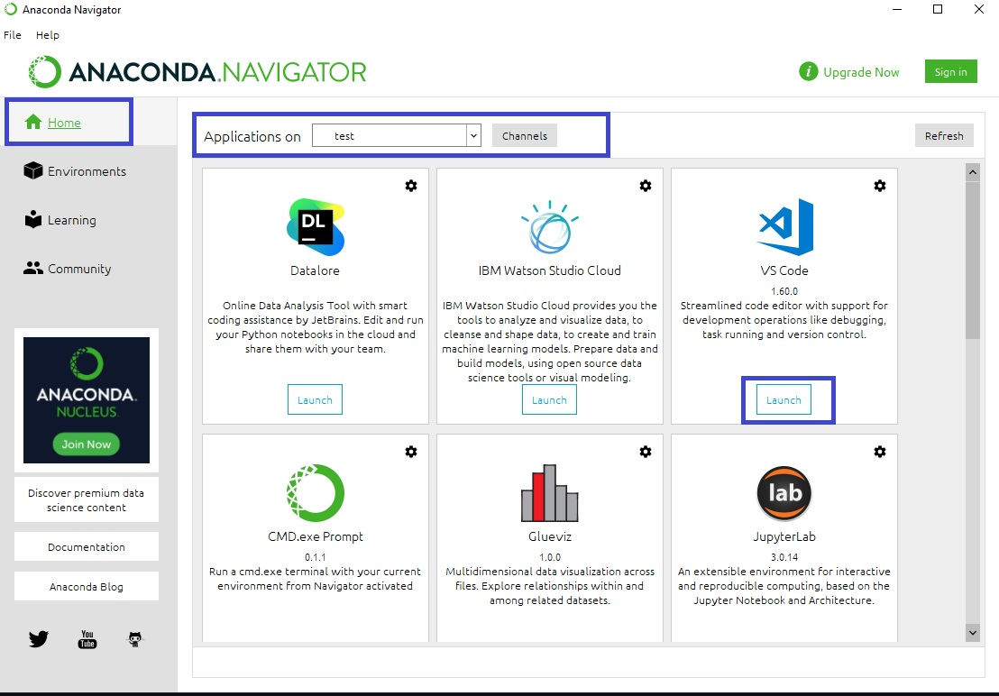

# Deep learning grocery image classification 

This is a research based deep learning project to compare and contrast different deep 
learning libraries and techniques and its effect on performance metrics such as 
training time and accuracy.

## Output
There will be 2 optimized deep learning models that are deployed. One is the best metrics for predicting less image classes (grouped class), 
and another will be trained to predict more specific image classes. Both models are deployed simultaneously using flask. The web app can be found 
in the deployment folder. An interactive dashboard is also imbedded in the web app. 

Techniques used for model optimization: 

* Image Augmentation

* Batch Normalization 

* Transfer Learning

* Multiple dataloader functions

* Parameter tuning


## Documentation

[KerasAPI](https://keras.io/api/preprocessing/)

[TensorflowAPI](https://www.tensorflow.org/api_docs/python/tf/keras/Model)

[Fast AI](https://github.com/fastai/fastai)

[pyTorch](https://github.com/pytorch/pytorch)

[Flask](https://flask.palletsprojects.com/en/2.0.x/)


## How to run deployed model 

* Download Anaconda navigator and set up environment with python 3.6. (https://docs.anaconda.com/anaconda/navigator/getting-started/) 
  Note that in the documentation, the env is set up with python 3.7, BUT for this project, 3.6 is needed. 

* Once set up, click on home, and launch vscode. Ensure that you have your enviromnent selected in the applications on dropdown. 

* Once vscode is open, open terminal, and use the cd command to access the deployment folder. 


* Below shows a list of commands to run to run the app. Run these in the vscode command prompt. 

* This command is to download all dependencies
```
pip install -r requirements.txt
```
* This command is to check if the dependencies are successfully installed. 
```
pip install -r requirements.txt
```
* Finally, run the command below to run the deployed models, and the dashboard. 
```
python app.py
```


  
## Author

- [@SohZongXian](https://github.com/SohZongXian)

  
